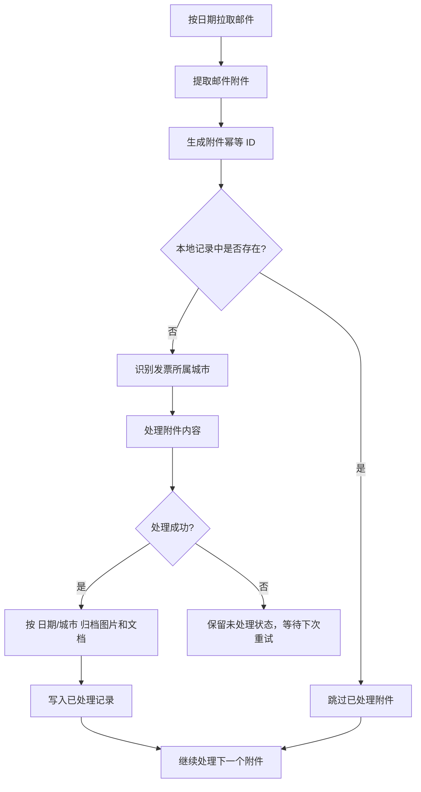
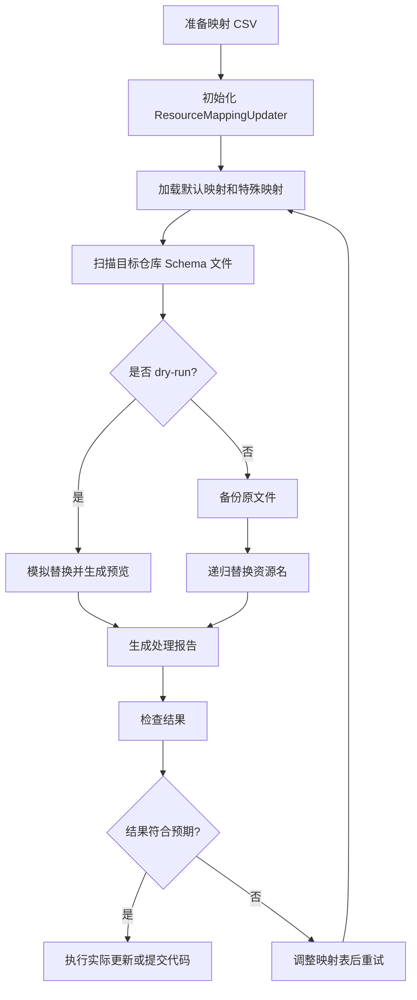

# Schema 资源名替换系统

一个用于批量替换 Schema 中资源名称的 Node.js 脚本项目。它支持默认映射、按 Schema 类型生效的特殊映射、Handler 链集成、dry-run 预览、备份、错误处理和执行报告。

## 功能概览

- **资源名替换**：递归处理 JSON Schema 中的字段名和字符串值。
- **双映射机制**：支持默认映射表和特殊映射表。
- **CSV 配置**：通过 CSV 维护旧资源名和新资源名的映射关系。
- **Dry-run 预览**：先模拟执行，查看会发生哪些变更。
- **备份与报告**：实际修改前可备份文件，并输出处理报告。
- **Handler 链**：可组合验证、备份、资源替换等处理器。
- **错误处理**：提供错误分类、重试和日志记录能力。
- **附件幂等去重**：为已处理邮件附件生成唯一 ID，重复执行时自动跳过。
- **发票城市分组**：从发票自身信息识别城市，并按 `日期/城市` 目录归档最终图片；PDF/XML/OFD 等中间文件可放入备份目录。
- **开票信息配置**：支持配置发票抬头、可选纳税人识别号、邮箱、手机号，并支持环境变量覆盖。

## 目录结构

```text
schema-resource-mapping/
├── README.md
├── package.json
├── .gitignore
├── attachmentIdempotency.js       # 邮件附件幂等 ID 生成和已处理记录存储
├── csvParser.js                  # CSV 解析、映射校验、映射缓存
├── dryRunAndErrorHandling.js      # Dry-run 执行器和错误处理器
├── handlerChain.js                # Handler 链和预置处理链
├── integrationConfig.js           # 集成配置和环境配置模板
├── invoiceCityOrganizer.js        # 发票城市识别和 日期/城市 归档
├── invoiceConfig.js               # 开票信息配置读取、校验和 payload 生成
├── invoice.config.example.json    # 开票信息配置模板，不含真实个人信息
├── resourceMappingHandler.js      # 核心资源映射替换逻辑
└── usageExamples.js               # 使用示例
```

## 安装

```bash
npm install
```

依赖包括：

- `csv-parser`
- `csv-writer`
- `glob`
- `winston`

## 准备映射文件

默认映射文件示例：`default_mapping.csv`

```csv
oldResourceName,newResourceName
oldResource1,newResource1
oldResource2,newResource2
```

特殊映射文件示例：`special_mapping.csv`

```csv
oldResourceName,newResourceName,schemaPattern
specialResource1,newSpecialResource1,userSchema
specialResource2,newSpecialResource2,productSchema
commonResource,newCommonResource,
```

字段说明：

| 字段 | 说明 |
| --- | --- |
| `oldResourceName` | 原资源名 |
| `newResourceName` | 替换后的资源名 |
| `schemaPattern` | 可选；指定只在某类 Schema 中生效 |

## 快速使用

```javascript
const { ResourceMappingUpdater } = require('./resourceMappingHandler');

async function main() {
  const updater = new ResourceMappingUpdater({
    defaultMappingPath: './default_mapping.csv',
    specialMappingPath: './special_mapping.csv',
    logger: console
  });

  const result = await updater.updateRepo('./sample-repo', {
    dryRun: true,
    backup: true,
    schemaPattern: '**/*.schema.json',
    outputReport: true
  });

  console.log(result.summary);
}

main().catch(console.error);
```

## 推荐执行流程

1. 准备 `default_mapping.csv` 和 `special_mapping.csv`。
2. 先用 `dryRun: true` 执行一次，检查报告和日志。
3. 确认替换结果符合预期后，再用 `dryRun: false` 执行实际修改。
4. 检查生成的备份和 CSV 报告。
5. 将修改后的文件提交到版本控制。

## 流程图



资源映射处理流程：



## 运行示例

```bash
node usageExamples.js
```

示例脚本会演示：

- 基本替换用法
- CSV 解析和校验
- Handler 链执行
- Dry-run 模式
- 错误处理和重试
- 完整仓库更新流程

## 邮件附件幂等去重

如果邮件是按日期查询，同一天内重复执行脚本时，可以用 `AttachmentIdempotencyManager` 在处理附件前做幂等校验。

```javascript
const { AttachmentIdempotencyManager } = require('./attachmentIdempotency');

const manager = new AttachmentIdempotencyManager({
  storePath: './data/processed-attachments.json',
  logger: console
});

const mail = {
  messageId: 'mail-001',
  date: '2026-06-06T10:00:00.000Z',
  from: 'sender@example.com',
  subject: '每日附件'
};

const attachments = [
  {
    attachmentId: 'attachment-001',
    filename: 'daily-report.csv',
    size: 128,
    contentType: 'text/csv',
    path: './downloads/daily-report.csv'
  }
];

const result = await manager.processAttachments(attachments, mail, async (attachment) => {
  // 在这里写原本的附件处理逻辑
  // 只有这里成功返回后，附件才会被写入已处理记录
  return { saved: true, filename: attachment.filename };
});

console.log(result);
```

幂等 ID 会组合以下信息并生成 SHA-256：

- 邮件 ID / Message-ID
- 邮件时间、发件人、标题
- 附件 ID / Content-ID
- 附件文件名、大小、MIME 类型
- 附件内容 hash（如果提供了 `content`、`path` 或 `filePath`）

处理成功后，本地会写入 `storePath` 指定的 JSON 文件。下次再次处理同一附件时，会直接跳过。

## 发票城市识别与分组归档

发票处理完成后，可以用 `InvoiceCityOrganizer` 从发票本身的信息里识别城市。默认情况下，最终目录 `日期/城市` 里只放图片；PDF、XML、OFD 等非图片中间文件会复制到备份目录。

```javascript
const { InvoiceCityOrganizer } = require('./invoiceCityOrganizer');

const organizer = new InvoiceCityOrganizer({
  outputRoot: './invoice-output',        // 最终产物目录：只放图片
  backupRoot: './invoice-output-backup', // 中间文件备份目录：PDF/XML/OFD 等
  logger: console
});

const result = organizer.organizeBatch([
  {
    invoice: {
      invoiceNo: '001',
      invoiceDate: '2026-06-06',
      taxBureau: '国家税务总局北京市朝阳区税务局',
      sellerAddress: '北京市朝阳区示例路1号'
    },
    artifacts: [
      './downloads/invoice-001.jpg',
      './downloads/invoice-001.pdf'
    ]
  },
  {
    invoice: {
      invoiceNo: '002',
      invoiceDate: '2026年06月06日',
      ocrText: '上海市增值税电子普通发票 销售方地址：上海市浦东新区示例路2号'
    },
    artifacts: [
      './downloads/invoice-002.jpg',
      './downloads/invoice-002.pdf'
    ]
  }
]);

console.log(result.groups);
```

生成目录示例：

```text
invoice-output/
└── 2026-06-06/
    ├── 北京/
    │   └── invoice-001.jpg
    └── 上海/
        └── invoice-002.jpg

invoice-output-backup/
└── 2026-06-06/
    ├── 北京/
    │   └── invoice-001.pdf
    └── 上海/
        └── invoice-002.pdf
```

城市识别会优先读取以下发票字段：

- `city`、`invoiceCity`、`billingCity`、`issuerCity`、`taxCity`
- `taxBureau`、`issuer`、`sellerAddress`、`buyerAddress`
- `ocrText`、`rawText`、`text`
- `seller.address`、`seller.taxBureau`、`buyer.address`

如果无法识别城市，会归档到 `未知城市` 文件夹。可以通过 `extraCities`、`cityAliases` 或 `unknownCityName` 扩展识别规则。

## 开票信息配置

开票信息包含个人/企业敏感信息，真实配置文件不要提交到 GitHub。项目提供模板：

```text
invoice.config.example.json
```

复制一份作为本地真实配置：

```bash
cp invoice.config.example.json invoice.config.json
```

配置字段：

```json
{
  "buyerName": "你的发票抬头或姓名",
  "buyerTaxNo": "",
  "buyerEmail": "your-email@example.com",
  "buyerMobile": "13800138000",
  "minInvoiceAmount": 100
}
```

字段说明：

| 字段 | 说明 | 是否必填 |
| --- | --- | --- |
| `buyerName` | 发票抬头，一般填名字或公司名 | 是 |
| `buyerTaxNo` | 纳税人识别号，个人抬头通常可空，企业抬头可能需要 | 否，按页面要求动态校验 |
| `buyerEmail` | 收票邮箱 | 建议填写，按页面要求动态校验 |
| `buyerMobile` | 收票手机号 | 建议填写，部分页面必填 |
| `minInvoiceAmount` | 最小开票金额阈值，低于该金额时拒绝自动开票并提示人工介入 | 默认 100 |

也可以用环境变量覆盖本地配置：

```bash
export INVOICE_BUYER_NAME="你的发票抬头"
export INVOICE_BUYER_TAX_NO=""
export INVOICE_BUYER_EMAIL="your-email@example.com"
export INVOICE_BUYER_MOBILE="13800138000"
export INVOICE_MIN_AMOUNT="100"
```

代码示例：

```javascript
const { InvoiceConfigManager } = require('./invoiceConfig');

const manager = new InvoiceConfigManager();
const config = manager.load();
const validation = manager.validate(config, {
  requireMobile: true,
  requireEmail: false,
  requireTaxNo: false
});

if (!validation.valid) {
  throw new Error(validation.errors.join('; '));
}

const amountCheck = manager.validateInvoiceAmount('47.21', config);
if (!amountCheck.allowed) {
  console.warn(amountCheck.message);
  // 不继续提交开票，交给人工介入重新开
  return;
}

const buyerPayload = manager.toBuyerPayload(config, { requireMobile: true });
console.log(buyerPayload);
```

## 常见配置

### Dry-run 模式

```javascript
await updater.updateRepo('./sample-repo', {
  dryRun: true,
  backup: true,
  schemaPattern: '**/*.schema.json',
  outputReport: true
});
```

### 实际更新模式

```javascript
await updater.updateRepo('./sample-repo', {
  dryRun: false,
  backup: true,
  schemaPattern: '**/*.schema.json',
  outputReport: true
});
```

### Handler 链

```javascript
const { HandlerChainFactory, PredefinedChains } = require('./handlerChain');

const chainManager = HandlerChainFactory.createStandardChain(
  mappingConfig,
  validationRules,
  backupConfig,
  { logger: console }
);

const result = await chainManager.executeChain(
  PredefinedChains.STANDARD,
  context,
  { dryRun: true }
);
```

## 注意事项

- 实际修改前建议始终先执行 dry-run。
- `dryRun: false` 时建议开启 `backup: true`。
- 映射 CSV 建议纳入版本控制，方便追溯变更。
- 特殊映射优先级高于默认映射。
- 如果同一个资源名存在多条映射，请先通过 CSV 校验能力检查冲突。

## 后续上传到 GitHub

晚点如果要上传，可以在本目录执行：

```bash
git init
git add .
git commit -m "Initial commit"
# 创建 GitHub 仓库后，再添加远端并推送：
# git remote add origin git@github.com:<your-name>/<repo-name>.git
# git branch -M main
# git push -u origin main
```

## License

MIT
